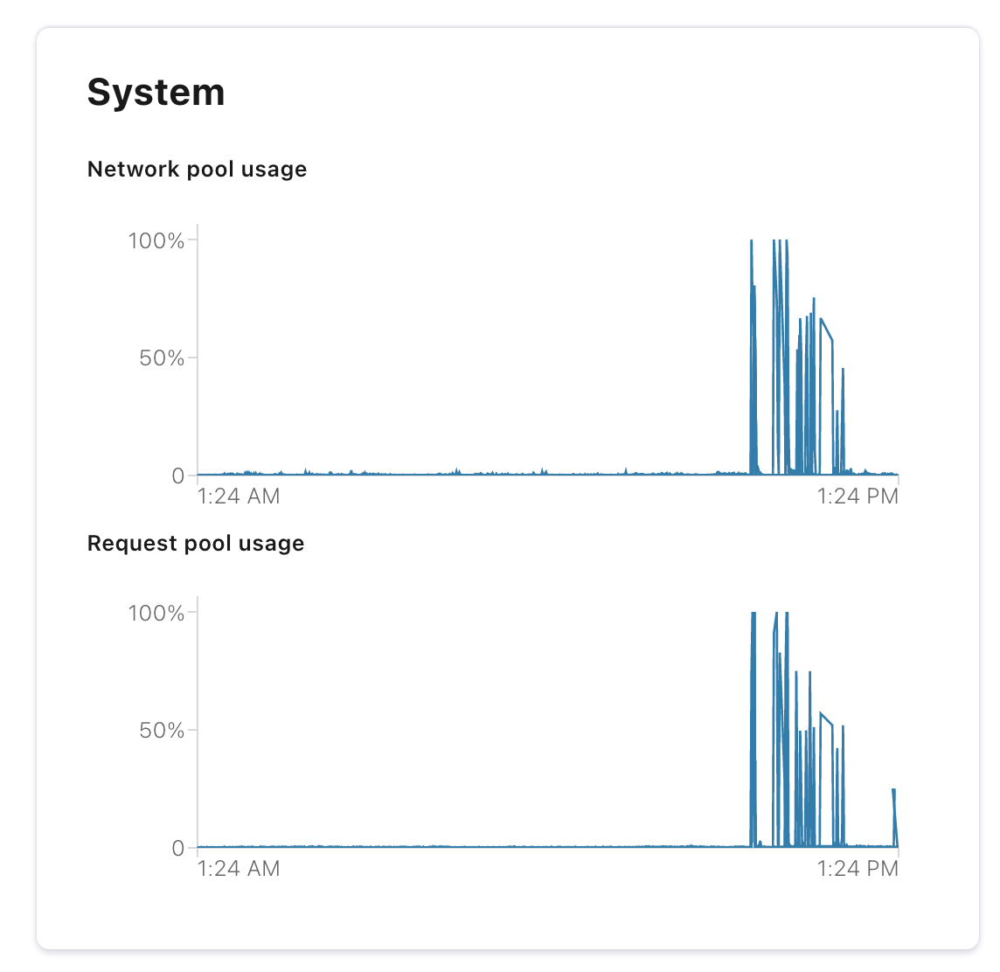

- Đối với các Broker có cấu hình cao, để tận dụng và sử dụng hết tối đa các tài nguyên, ít nhất Ultilization đạt > 60%, thì chúng ta cần thực Monitoring và chỉnh sửa các thông số để có hiệu năng tốt hơn. Các hiệu số cần chỉnh sửa:

    - ```num.replica.fetchers```: Số lượng Worker Threads dùng để Replicate Message giữa các Broker với nhau, càng tăng thì càng nhanh. Ví dụ Replicate từ Leader → Follower, Observers tương tự.

    - ```num.io.threads```: Số lượng Worker Threads dùng để cho việc I/O. Càng tăng thì Network Pool càng cao.

    - ```num.network.threads```: Số lượng Worker Threads dùng để cho việc Request IN/OUT. Càng tăng thì Request Pool càng cao.

    - ```confluent.tier.archiver.num.threads```: Số lượng Worker Threads dùng để cho việc lưu dữ liệu vào Cold Storage (Tired Storage). Tuỳ vào nhu cầu, càng tăng thì lưu/đọc càng nhanh.

- Để thực hiện hiệu chỉnh thì cần vào Control Center xem các Metrics liên quan đến Ultilization kết hợp các Metrics từ GCP/Grafana. Ví dụ:



Lượng Network Pool và Request Pool cao, gây cho Broker bị chậm, cần tăng ```num.io.threads``` và ```num.network.threads``` lên cao hơn so với Setting hiện tại.


## OS Tuning

1. Virtual Memory
Swap và dirty pages

- Swap là tính năng của Linux virtual memory subsystem, trong trường hợp OS dùng hết RAM vật lý, thì swap sẽ được sử dụng để lấy một phần disk làm bộ nhớ tạm. Điều này có lợi trong một số tình huống, và là setting mặc định của Linux. Nhưng trong môi trương high performance, sử dụng swap dẫn tới các lỗi nghiêm trọng về CPU wait nên cần được ngăn ngừa

    ```
    vm.swappiness = 1 (default >> 1)
    ```

- Kafka dựa khá nhiều vào hiệu năng của Disk IO để có thể provide được response times thấp tới producer. Việc tinh chỉnh các thông số Dirty pages hợp lý sẽ cải thiện tốc độ write các segment của log xuống disk.

    ```
    vm.dirty_background_ratio = 5 (default = 10)

    vm.dirty_ratio = 60 (default = 20)
    ```

- Kiểm tra thử với: sysctl -a | grep vm.


2. File System: consider XFS và EXT4

- EXT4 hoạt động ổn định trong hầu hết các tình huống

- XFS có hiệu suất cao hơn đối với Kafka
—> Chọn EXT4 để an toàn


3. Networking

- Kiểm tra các thông số từ sysctl với sysctl -a | grep ipv4 và sysctl -a | grep net.core

- Cần thực hiện Optimize thay đổi: ```/etc/sysctl.conf``` với các thông số sau: 

    ```
    vm.swappiness: 1
    vm.dirty_background_ratio: 5
    vm.dirty_ratio: 60
    vm.max_map_count: 262144
    ipv4.tcp_window_scaling: 1
    net.ipv4.tcp_max_syn_backlog: 2048
    net.core.wmem_default: 131072
    net.core.netdev_max_backlog: 250000
    net.ipv4.tcp_sack: 1
    net.core.rmem_max: 4194304
    net.core.wmem_max: 4194304
    net.core.rmem_default: 4194304
    net.core_wmem_default: 4194304
    net.core.optmem_max: 4194304
    net.ipv4.tcp_rmem: "4096 87380 4194304"
    net.ipv4.tcp_wmem: "4096 65536 4194304"
    net.ipv4.tcp_low_latency: 1
    net.ipv4.tcp_adv_win_scale: 1
    net.core.somaxconn: 262144
    fs.file-max: 3283846
    ```
- Sau khi thay đổi thì kiểm tra ```sysctl -a``` hoặc ```sysctl -p```

## Tuning Java options

- Bật G1 thay vì GC

    ```
    export KAFKA_JVM_PERFORMANCE_OPTS=-XX:MetaspaceSize=96m -XX:+UseG1GC -XX:MaxGCPauseMillis=20 -XX:InitiatingHeapOccupancyPercent=35 -XX:G1HeapRegionSize=16M -XX:MinMetaspaceFreeRatio=50 -XX:MaxMetaspaceFreeRatio=80
    ```


    - Kể từ bản 7, Java provide garbage collection G1 (Garbage first) để thay thế GC, với thiết kế cho phép tự động điều chỉnh cho các mức workload khác nhau, xử lý heap size tốt hơn, và có cơ chế consistent pause time cho GC,…

    - Các cài đặt của G1 hoạt động tốt trong đa số tình huống, chỉ có 2 setting cần tinh chỉnh


- MaxGCPauseMillis = 20ms (default 200ms)

- InitiatingHeapOccupancyPercent = 35 (default 45) —> G1 khởi động collection cycle khi 35% heap size được sử dụng)

- Kiểm tra JVM Heap, Xms = Xmx = 30% RAM

- Ví dụ: 


    ```
    KAFKA_HEAP_OPTS: "-Xms6g -Xmx6g"
    No labels
    ```
